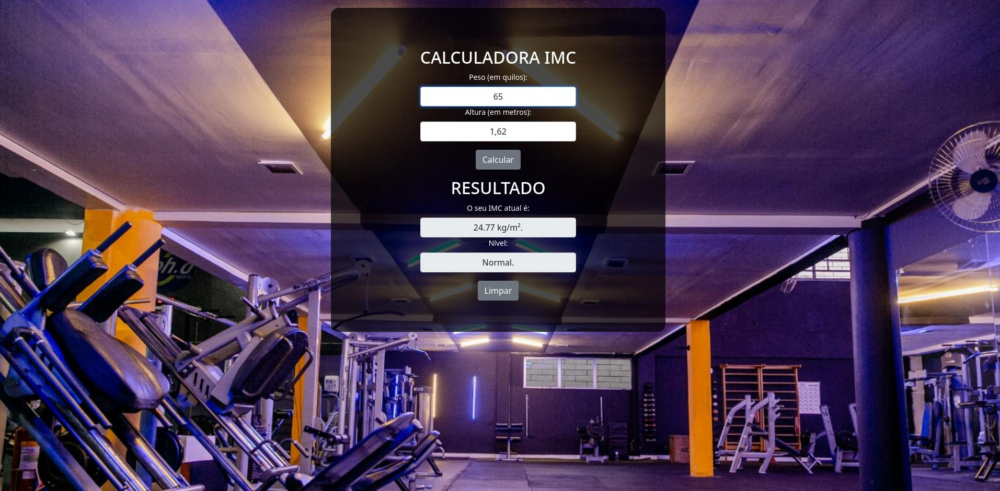
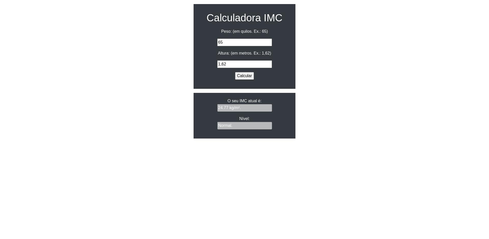

<h1> PROJETO: Calculadora IMC </h1>
<h2> Diretório do projeto <i>calculadora IMC</i> </h2>

Interações adicionadas até o momento:

1) Função de Cálculo do IMC: IMC = Peso / (Altura * Altura)
2) Botão de Calcular
3) Botão de Limpar formulário
4) Desativadas as setas padrões do input type='number'
5) Atualizado Layout

# Layout atualizado:

# Layout antigo:
