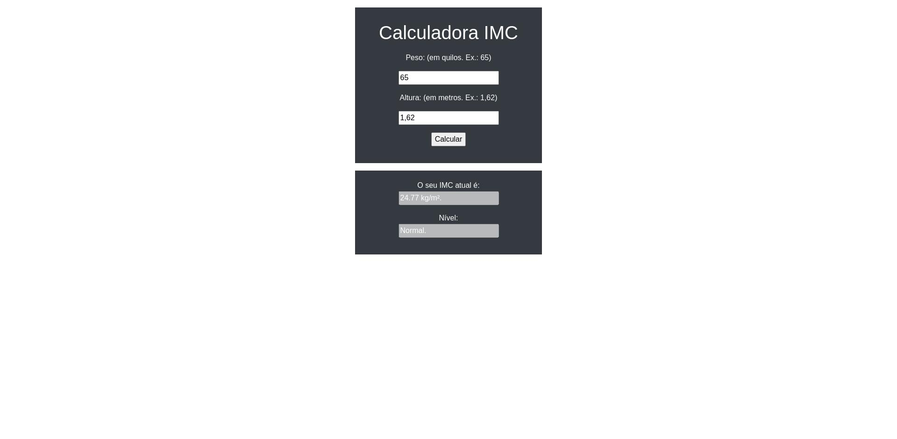

<h1> PROJETO: Calculadora de IMC </h1>
<h2> Diretório do projeto <i>calculadora IMC</i> </h2>

* Link do projeto no Netlify:  

Interações adicionadas até o momento:

1) Função de Cálculo do IMC: IMC = Peso / (Altura * Altura);
2) Botão de Calcular;
3) Botão de Limpar formulário;
4) Adicionada validação para os campos e valor zerado;
5) Atualizado Layout, utilizando Tailwind CSS;

# Layout ainda mais atualizado, 22/08/2023:

# Layout atualizado:

# Layout antigo:
